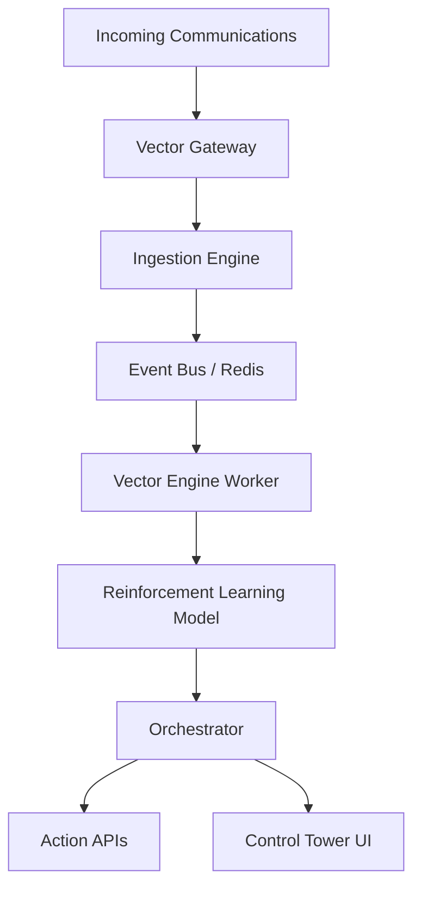

# VECTOR

**A distributed AI air traffic control system that transforms enterprise communication into real-time autonomous workflows using reinforcement learning and event-driven microservices.**

## System Architecture



## Running the System

Vector comes with a "Control Tower" dashboard and a unified startup script.

### One-Command Start
To launch the entire suite of microservices, UI, and backend workers:

```powershell
.\start_vector.ps1
```

This will:
1. Verify Redis is running (or attempt to start it via Docker).
2. Start the Gateway, Ingestion, Vector Engine, and Orchestrator processes in the background.
3. Start the Next.js Frontend.
4. Launch the Electron Mission Control application.

Press `Ctrl+C` in the terminal to gracefully shut down all services.

## Features

- **Autonomous Routing:** Uses RL to classify, prioritize, and route communications without human intervention.
- **Event-Driven Resilience:** Built on a robust Redis event bus with fallback buffering and retry mechanisms.
- **Control Tower UI:** Real-time visibility into the system's decisions, imitating a NASA mission control dashboard.
- **Deterministic Simulation:** Includes a built-in demo scenario showing routine, high priority, and urgent escalation workflows.
